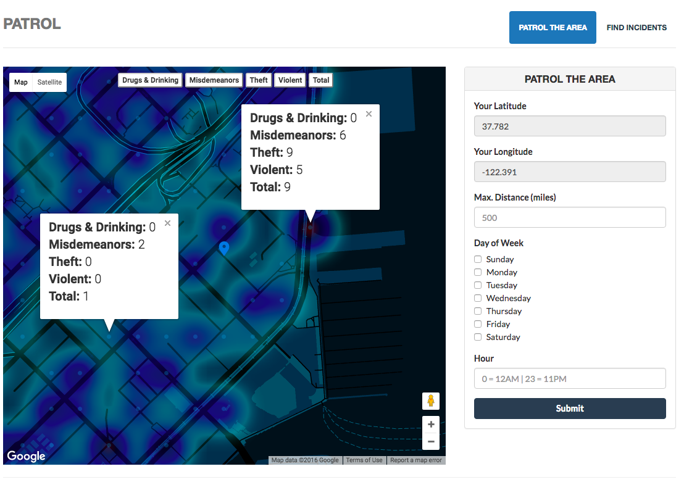
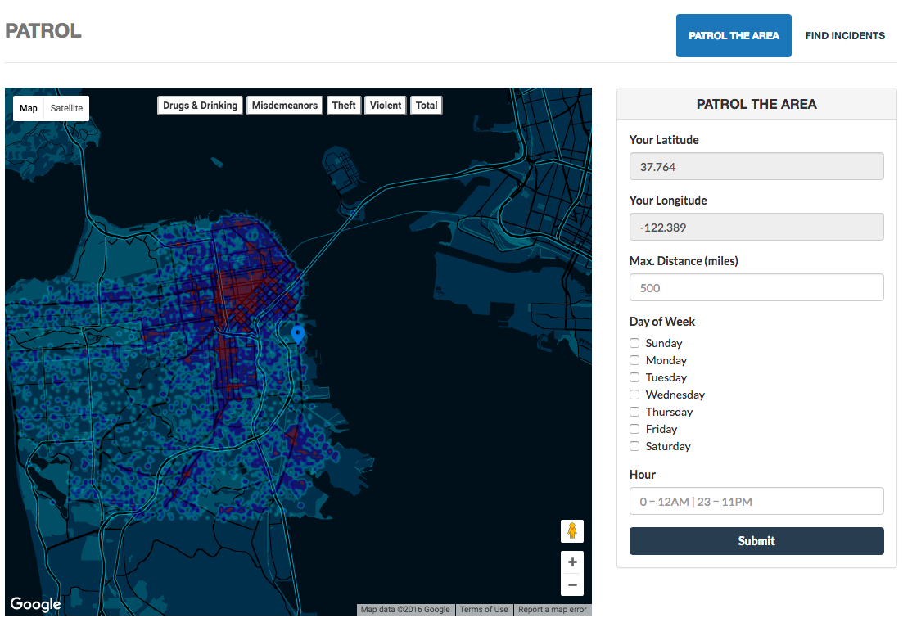

# Patrol
Crime data mapping application

### Project Description
If you have ever been to a strange city and not known which areas of the city to avoid, or you're trying find a safe place to park your car, or you're trying to find a safe route home, or you're a police officer trying to figure out which areas to PATROL at certain times during the week - Patrol is for you.

San Francisco was just recently deemed the city with the highest per-capita crime ratein the US. With the recent wave of violent crime and car break-ins, the visibility to this crime is what could empower the community to help solve a problem the police can't on their own.

People commit crimes because they think they can get away with it, and the goal of this application is to increase the visibility of crime in your neighborhood, around your hotel, on your walk back home, etc. to both decrease crime opportunity and make citizens more aware of their surroundings.


### Patrol over China Basin in SF at 4:30pm on a Friday




### Patrol over San Francisco at 7:15pm on a Friday




## Instructions to run locally

1) Clone repository and download npm packages

```
git clone https://github.com/alexpadraic/Patrol.git
cd Patrol/
npm install
```

2)  Import csv of analyzed data

```
mongoimport -d patrol -c crimepoints --type csv --file crimepointsForUpload.csv --headerline
```

3) Launch mongod in one terminal then run server.js in another tab

````
mongod
node server.js
````

3) Open browser and navigate to `http://localhost:3000/`


## Questions

For questions [and donations], please contact Alexander Pellas at alexpadraic@gmail.com